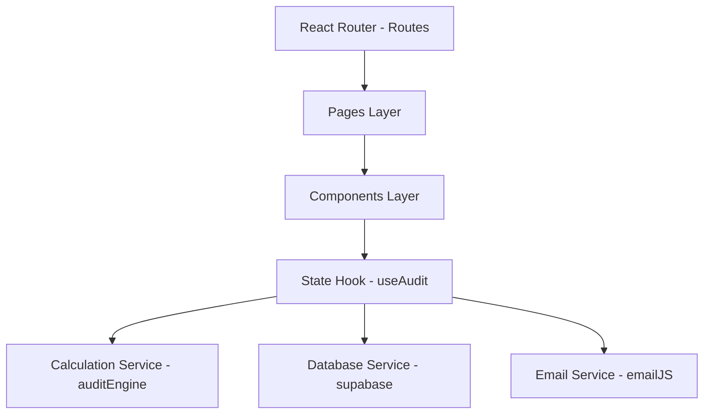

# Architecture Document - AI Spend Audit Tool

This document outlines the software design, directory structure, data flow, and core services powering the AI Spend Audit SaaS application.

---

## 🏛️ System Overview

The application is structured as a client-centric Single Page Application (SPA) that acts as a financial spend calculator and advisor for AI tool workspaces. It has three core layers:



1. **Routing & Pages Layer**: React Router DOM orchestrates route states (Landing, Audit Form, Dashboard, Public Report, 404) wrapping page mounts with Framer Motion transitions.
2. **State & Orchestration Layer**: The `useAudit` React hook coordinates inputs, loads reports, saves states, and handles network triggers.
3. **Calculation & Services Layer**: Includes the core spend comparing logic, Supabase database bindings (with local storage fallbacks), and EmailJS client integrations.

---

## 📁 File Structure & Mapping

* **`src/router/AppRouter.jsx`**: Coordinates routes. Configures a parent `<Layout />` wrapping page outlets with sticky navigation headers and footers.
* **`src/hooks/useAudit.js`**: Orchestrates component forms. Synchronizes tool listings to LocalStorage, handles submission saving, and loads public report keys.
* **`src/services/auditEngine.js`**: Functional cost algorithms:
  * Sums current costs checking seat minimum limitations (e.g. Claude Team 5-seat minimum).
  * Audits IDE overlaps (Cursor AI + GitHub Copilot redundant seat mappings).
  * Approximates API token savings through mini-model migrations and semantic caches.
  * Generates advice impact cards.
* **`src/services/supabase.js`**: Database bindings. Connects to PostgreSQL table schema via Supabase JS client. If environment variables are absent, reads and writes from LocalStorage, allowing local standalone runs.
* **`src/services/email.js`**: Email dispatching using `@emailjs/browser` directly to user's registered inbox.
* **`src/styles/index.css`**: Tailwind CSS v4 compiler layer with custom neon themes, responsive glassmorphism classes, and keyframe animations.

---

## 💾 Supabase Database Entity Relationship (ERD)

The database requires a single table `audits` for storing report details:

```text
Table: audits
  - id UUID (PRIMARY KEY, Default gen_random_uuid())
  - created_at TIMESTAMP WITH TIME ZONE (Default timezone('utc'))
  - email TEXT (User business contact)
  - team_size INTEGER (Active team seat size)
  - total_current_spend INTEGER (Monthly cost before optimization)
  - total_optimized_spend INTEGER (Monthly cost after optimization)
  - monthly_savings INTEGER (Monthly unoptimized waste savings)
  - yearly_savings INTEGER (Annual unoptimized waste savings)
  - optimization_score INTEGER (Stack efficiency rating from 0-100)
  - breakdown JSONB (Array representing scanned tool metrics)
  - recommendations JSONB (Array representing actionable advice cards)
```

---

## 🔒 Security & Privacy Considerations

* **Data Masking**: On the shareable read-only public report page ([PublicReportPage.jsx](file:///Users/daksh/Documents/GSSOC_OPEN%20SOURCE/Credex%20Task/src/pages/PublicReportPage.jsx)), the owner's email address is dynamically masked (e.g. `d****h@company.com`) to prevent scraper spam.
* **Client-side Processing**: API calculations are computed in the browser, preventing raw pricing configurations from leaking over network lines.
